# WANFAM GitHub Workflows & Automation

This directory contains the complete automation setup for the WANFAM repository, including pull request validation, reviewer assignment, branch protection, and repository configuration.

## 📁 Directory Structure

```
.github/
├── workflows/
│   ├── auto-assign-reviewers.yml    # Smart reviewer assignment
│   ├── branch-protection.yml        # Automated branch protection setup
│   ├── pr-validation.yml           # Pull request validation checks
│   └── setup-repo-variables.yml    # Repository variable configuration
├── CODEOWNERS                       # File-based ownership and reviewers
├── CONTRIBUTING.md                  # Contribution guidelines
├── pull_request_template.md         # Standardized PR template
├── REVIEWER-MANAGEMENT.md           # Detailed reviewer system docs
├── setup-branch-protection.ps1     # PowerShell branch protection script
├── setup-branch-protection.sh      # Bash branch protection script
└── README.md                        # This file
```

## 🔄 Workflow Overview

### Complete PR Lifecycle

```mermaid
graph TD
    A[Developer Creates PR] --> B[auto-assign-reviewers.yml]
    B --> C[pr-validation.yml]
    C --> D{All Checks Pass?}
    D -->|No| E[❌ PR Blocked]
    D -->|Yes| F[✅ Ready for Review]
    F --> G[Human Review Required]
    G --> H{Approved?}
    H -->|No| I[Changes Requested]
    H -->|Yes| J[🚀 Can Merge]
    I --> C
```


## 🤖 Workflow Details

### 1. **auto-assign-reviewers.yml** - Smart Reviewer Assignment

**Triggers:** When a PR is opened, reopened, or marked ready for review

**What it does:**
- 🔍 **Parses CODEOWNERS file** to find file-specific reviewers
- 📋 **Reads repository variables** for fallback reviewers
- 🧠 **Smart filtering** - excludes PR author, respects limits
- 👥 **Assigns reviewers** automatically
- 🏷️ **Auto-labels PRs** based on changed files

**Key Features:**
```yaml
# Multi-source reviewer detection:
1. CODEOWNERS file parsing
2. Repository variables (DEFAULT_REVIEWERS)
3. Configurable limits (MAX_REVIEWERS)
4. Automatic PR author exclusion
```

**Example Output:**
```
Found potential reviewers: isaac, alice, frontend-team
Max reviewers to assign: 2
✅ Requested reviews from: isaac, alice
Added labels: frontend, documentation
```

### 2. **pr-validation.yml** - Quality Gates

**Triggers:** On all PR events (opened, edited, synchronized, reopened)

**Validation Checks:**

#### ✅ **User File Validation**
```bash
# For files in users/ directory:
- Validates YAML format
- Ensures 'linkedin:' field exists
- Ensures 'github:' field exists
- ❌ Fails if required fields missing
```

#### ✅ **Code Quality Check**
```bash
# Scans all code files for:
- Merge conflict markers (<<<<<<< HEAD, =======)
- Covers: .js, .jsx, .ts, .tsx, .py, .md files
- ❌ Fails if conflicts found
```

#### ✅ **PR Requirements**
```bash
# Validates PR metadata:
- Title length (minimum 10 characters)
- Logs description length
- ❌ Fails if title too short
```

**Branch Protection Integration:**
This workflow creates the `validate-changes` status check that's required for merging.

### 3. **setup-repo-variables.yml** - Configuration Management

**Triggers:** Manual workflow dispatch

**Purpose:** Configure repository variables for reviewer management

**Variables Set:**
- `DEFAULT_REVIEWERS`: Comma-separated list of fallback reviewers
- `MAX_REVIEWERS`: Maximum number of reviewers to assign per PR

**Usage:**
1. Go to Actions tab
2. Select "Setup Repository Variables"
3. Click "Run workflow"
4. Enter reviewers and limits
5. Variables are created/updated automatically

### 4. **branch-protection.yml** - Security Enforcement

**Triggers:** 
- Manual workflow dispatch
- Push to main/master branch (when workflow file changes)

**Protection Rules Applied:**
```yaml
Protected Branches: main, master (if they exist)

Required Status Checks:
  - validate-changes (from pr-validation.yml)
  - Strict mode enabled

Required Pull Request Reviews:
  - Minimum 1 approval required
  - Code owner reviews required
  - Stale reviews dismissed on new commits

Restrictions:
  - No force pushes allowed
  - No branch deletions allowed
  - Conversation resolution required
```

## 🛠️ Setup & Configuration

### Initial Setup

1. **Push workflows to repository:**
   ```bash
   git add .github/
   git commit -m "feat: add comprehensive GitHub workflows"
   git push origin main
   ```

2. **Configure reviewers** (choose one method):

   **Method A: CODEOWNERS file** (Recommended)
   ```bash
   # Edit .github/CODEOWNERS
   * @isaac @alice
   /frontend/ @frontend-team
   /backend/ @backend-team
   ```

   **Method B: Repository variables**
   - Run "Setup Repository Variables" workflow
   - Set DEFAULT_REVIEWERS: `isaac,alice,bob`
   - Set MAX_REVIEWERS: `2`

3. **Enable branch protection:**
   ```powershell
   # Option 1: Automated (protects main and master if they exist)
   # Push workflows, automatic setup attempts

   # Option 2: Manual PowerShell (both main and master)
   .\setup-branch-protection.ps1

   # Option 3: Protect only specific branches
   .\setup-branch-protection.ps1 -Branches @("master")
   .\setup-branch-protection.ps1 -Branches @("main", "develop")

   # Option 4: Custom configuration
   .\setup-branch-protection.ps1 -MinReviewers 2 -RequireCodeOwners:$true
   ```

### Configuration Options

#### Reviewer Management
| Configuration | Location | Purpose |
|---------------|----------|---------|
| CODEOWNERS | `.github/CODEOWNERS` | File-specific reviewers |
| DEFAULT_REVIEWERS | Repository variables | Fallback reviewers |
| MAX_REVIEWERS | Repository variables | Assignment limits |

#### Branch Protection
| Setting | Default | Configurable |
|---------|---------|--------------|
| Min reviewers | 1 | ✅ PowerShell script |
| Code owner reviews | Required | ✅ PowerShell script |
| Status checks | validate-changes | ❌ Fixed |
| Force pushes | Blocked | ❌ Fixed |

## 🔍 Monitoring & Troubleshooting

### Checking Workflow Status

1. **Go to Actions tab** in your repository
2. **View recent workflow runs** for each PR
3. **Click on specific runs** to see detailed logs

### Common Issues & Solutions

#### ❌ No Reviewers Assigned
**Symptoms:** PRs created without reviewer assignment
**Causes & Solutions:**
- Empty CODEOWNERS file → Add reviewers to `.github/CODEOWNERS`
- No repository variables → Run "Setup Repository Variables" workflow
- All potential reviewers are PR author → Add more reviewers

#### ❌ Validation Failures
**Symptoms:** Red ❌ status on PR
**Common Causes:**
- Missing linkedin/github fields in user files
- Merge conflict markers in code
- PR title too short (<10 characters)

#### ❌ Branch Protection Not Working
**Symptoms:** Can merge without approval
**Solutions:**
- Run `.\setup-branch-protection.ps1` manually
- Check repository permissions (need admin access)
- Verify workflows are enabled

### Workflow Logs Examples

**Successful Assignment:**
```
✅ Auto Assign PR Reviewers
Found potential reviewers: isaac, alice
Max reviewers to assign: 2
✅ Requested reviews from: isaac, alice
Added labels: frontend
```

**Validation Success:**
```
✅ PR Validation
Validating users/john-doe.yml...
✓ users/john-doe.yml is valid
✓ No merge conflicts found
PR Title: feat: add John Doe user profile (28 characters)
```

**Validation Failure:**
```
❌ PR Validation
Error: users/jane-doe.yml must contain both 'linkedin:' and 'github:' fields.
```

## 🎯 Benefits & Features

### Automation Benefits
- ✅ **Zero manual reviewer assignment** - Fully automated
- ✅ **Quality gates** - Prevents broken code from merging
- ✅ **Consistent process** - Same rules for everyone
- ✅ **Scalable** - Easy to add teams and reviewers
- ✅ **Configurable** - Adjust without code changes

### Security Features
- 🔒 **Required reviews** - No bypassing human approval
- 🔒 **Status checks** - Code must pass validation
- 🔒 **Conversation resolution** - All feedback addressed
- 🔒 **No force pushes** - Preserves git history
- 🔒 **Code owner enforcement** - Right people review right code

### Developer Experience
- 🚀 **Immediate feedback** - Fast validation results
- 🚀 **Clear requirements** - Standardized PR template
- 🚀 **Auto-labeling** - Easy PR categorization
- 🚀 **Smart assignment** - Right reviewers, automatically

## 📚 Related Documentation

- [CONTRIBUTING.md](CONTRIBUTING.md) - Complete contribution guidelines
- [REVIEWER-MANAGEMENT.md](REVIEWER-MANAGEMENT.md) - Detailed reviewer system documentation
- [pull_request_template.md](pull_request_template.md) - PR template for contributors

## 🛟 Support

For workflow issues:
1. Check workflow logs in Actions tab
2. Review this README for common solutions
3. Check CODEOWNERS file for reviewer configuration
4. Verify repository variables are set correctly
5. Open an issue if problems persist

---

*This automation system ensures every pull request is properly reviewed, validated, and documented before merging into the main branch.*
