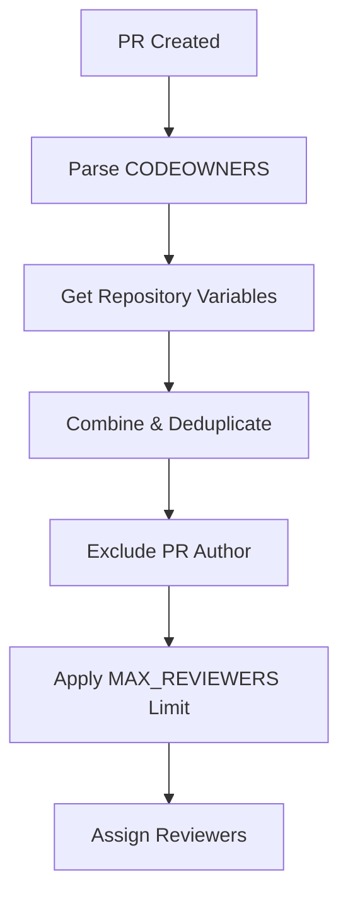

# Reviewer Management System

This repository uses a flexible, scalable reviewer assignment system that eliminates single points of failure and allows for easy configuration.

## 🔧 How It Works

The system automatically assigns reviewers using **multiple sources** in this priority order:

1. **CODEOWNERS file** (`.github/CODEOWNERS`) - File/path-specific owners
2. **Repository Variables** - Configurable fallback reviewers
3. **Smart filtering** - Excludes PR author, respects limits

## 📁 CODEOWNERS Configuration

Edit `.github/CODEOWNERS` to define reviewers for specific paths:

```bash
# Global reviewers (all files)
* @alice @bob

# Frontend team
/frontend/ @frontend-team @alice
/src/components/ @ui-team

# Backend team  
/backend/ @backend-team @bob
/api/ @api-team

# DevOps and Infrastructure
/.github/ @devops-team @alice
/docker/ @devops-team
/k8s/ @devops-team

# Documentation
*.md @docs-team @alice
/docs/ @docs-team

# User data (requires careful review)
/users/ @alice @bob @security-team
```

## ⚙️ Repository Variables

Configure fallback reviewers and limits using repository variables:

### Option 1: GitHub UI
1. Go to **Settings** → **Secrets and variables** → **Actions** → **Variables** tab
2. Add these variables:
   - `DEFAULT_REVIEWERS`: `alice,bob,charlie` (comma-separated usernames)
   - `MAX_REVIEWERS`: `2` (number of reviewers to assign)

### Option 2: Automated Setup
Run the **"Setup Repository Variables"** workflow:
1. Go to **Actions** tab
2. Click **"Setup Repository Variables"**
3. Click **"Run workflow"**
4. Enter reviewers: `alice,bob,charlie`
5. Set max reviewers: `2`

## 🎯 Smart Assignment Logic



### Example Scenarios

**Scenario 1: Frontend PR**
- Changed files: `/frontend/src/App.js`
- CODEOWNERS match: `@frontend-team @alice`
- Variables: `@bob,@charlie`
- Result: Assigns `@frontend-team`, `@alice` (up to MAX_REVIEWERS limit)

**Scenario 2: User Data PR**
- Changed files: `/users/new-user.yml`
- CODEOWNERS match: `@alice @bob @security-team`
- Variables: `@charlie`
- Result: Assigns first 2 from combined list (respects MAX_REVIEWERS)

**Scenario 3: General PR**
- Changed files: `/README.md`
- CODEOWNERS match: `@docs-team @alice` (from `*.md` rule)
- Variables: `@bob,@charlie`
- Result: Assigns `@docs-team`, `@alice`

## 🛠️ Configuration Commands

### PowerShell Script (Enhanced)
```powershell
# Basic setup (1 reviewer required)
.\setup-branch-protection.ps1

# Require 2 reviewers
.\setup-branch-protection.ps1 -MinReviewers 2

# Don't require code owner approval
.\setup-branch-protection.ps1 -RequireCodeOwners:$false

# Custom configuration
.\setup-branch-protection.ps1 -MinReviewers 3 -RequireCodeOwners:$true
```

## 🔍 Troubleshooting

### No Reviewers Assigned
**Cause**: Empty CODEOWNERS and no repository variables
**Solution**: 
1. Add users to `.github/CODEOWNERS`
2. Or run "Setup Repository Variables" workflow
3. Or set variables manually in GitHub UI

### Too Many/Few Reviewers
**Cause**: MAX_REVIEWERS setting
**Solution**: Update `MAX_REVIEWERS` repository variable

### Wrong Reviewers Assigned
**Cause**: CODEOWNERS rules too broad/narrow
**Solution**: Review and update `.github/CODEOWNERS` patterns

## 📊 Monitoring

Check workflow logs to see reviewer assignment:
1. Go to **Actions** tab
2. Click on a PR's "Auto Assign PR Reviewers" run
3. View logs for assignment details:
   ```
   Found potential reviewers: alice, bob, frontend-team
   Max reviewers to assign: 2
   ✅ Requested reviews from: alice, bob
   ```

## 🔄 Migration from Hardcoded System

If migrating from hardcoded reviewers:

1. **Identify current reviewers** in your old system
2. **Add them to CODEOWNERS** for relevant paths
3. **Set repository variables** as fallback
4. **Test with a sample PR**
5. **Adjust MAX_REVIEWERS** as needed

## 🎁 Benefits

- ✅ **No single point of failure** - Multiple reviewer sources
- ✅ **Scalable** - Easy to add/remove reviewers
- ✅ **Flexible** - Different reviewers for different areas
- ✅ **Configurable** - Adjust limits without code changes
- ✅ **Smart** - Excludes PR authors automatically
- ✅ **Maintainable** - Clear separation of config and logic
